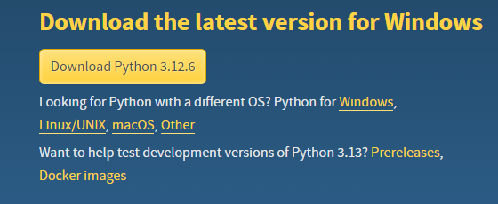

# Setup

### 1. Install Workshop Mods
Install the following mods from the Steam Workshop:
* Wallon Circuit Track - https://steamcommunity.com/sharedfiles/filedetails/?id=3335468946
* Track Creator Plus - https://steamcommunity.com/sharedfiles/filedetails/?id=2434420628

### 2. Run The Game
1. Open Trailmakers and load into the test zone with mods enabled. 
2. Enable the "Track Creator Plus" mod and wait for it to finish loading
3. You can now close the game.

### 3. Install Python
Install python from https://www.python.org/downloads/

### 4. Run Python Installer
Run the Python installation wizard. Keep all of the default options selected.
> [!IMPORTANT] 
> Make sure to check the option that says "Add Python to environment variabled"

### 5. Install Python Libraries
Install the following python libraries:
* beautifulsoup4 - https://pypi.org/project/beautifulsoup4/
* requests - https://pypi.org/project/requests/

To install a library for python, open your terminal and run the following commands:
`pip install beautifulsoup4`
`pip install requests`

### 6. Run the Installation Script
1. Download this folder and extract the files. 
2. Run the [installer](installer.bat) batch file
3. When prompted, provide a link to your steam profile in the following format: `https://steamcommunity.com/profiles/123456789/`

### 7. Launch the Game
1. Load into the test zone track 
2. Enable both mods listed in Step 1
3. Click "Load Track or Autosave"
4. Select the name of the track you want to load